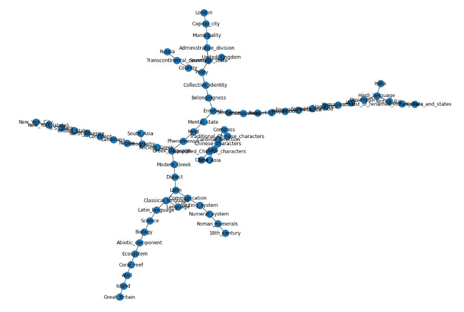

# Wikipedia Graph Visualization using Networkx

## Table of Contents

* [About the Project](#about-the-project)
  * [Tasks](#tasks)
  * [Built With](#built-with)
* [Fork the Repo and Contribute](#Fork-the-Repo-and-Contribute)
* [Contact](#contact)

## About the Project

In this project, we explore [NetworkX](https://networkx.org/), a Python library for graph algorithms and visualizations. We scrape Wikipedia pages for any arbitrary search word and get the first web link referred by the wiki page. Then, we visit that page and again get the first link. We recursively keep visiting the web links and store them in a graph. If the link is already visited, we stop. The data is stored using Pickle library in Python.

### Built With

* NetworkX
* Beautiful Soup
* Requests
* Pickle
* Jupyter Notebook

## Fork the Repo and Contribute

Contributions are what make the open source community such an amazing place to be learn, inspire, and create. Any contributions you make are **greatly appreciated**.

1. Fork the Project (click on `Fork` in the top-left corner)
2. Create your Feature Branch (`git checkout -b feature`)
3. Commit your Changes (`git commit -m 'Add some AmazingFeature'`)
4. Push to the Branch (`git push origin feature`)
5. Open a Pull Request

## Contact

Sinjoy Saha 
  * [LinkedIn](https://linkedin.com/in/sinjoysaha)
  * [Twitter](https://twitter.com/SinjoySaha)

